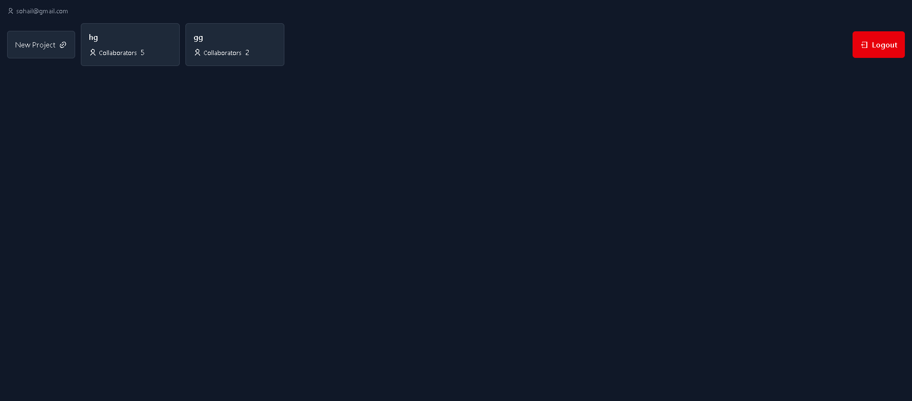
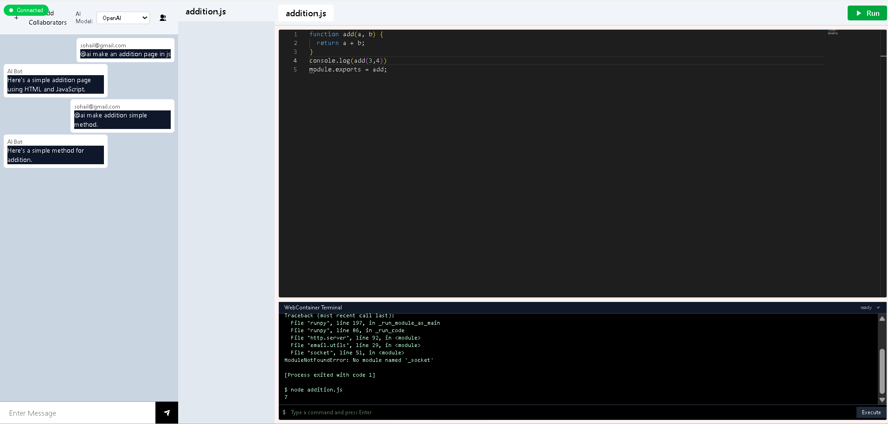

# Devin AI

<div align="center">

**A collaborative, AI-powered coding platform where teams build projects together**

Real-time collaboration • AI Code Generation • In-Browser Execution

[](https://react.dev/)
[](https://nodejs.org/)
[](https://www.mongodb.com/)
[](https://socket.io/)

</div>

---

## What is Devin AI?

Devin AI is a **collaborative, AI-powered coding platform** where teams can build projects together with real-time chat and in-browser code generation. Use `@ai` in messages to get AI assistance (Google Gemini, Hugging Face, or OpenAI), generate complete file trees, and run code via WebContainer—all within a shared project workspace.

**Perfect for:** Team collaboration, prototyping, learning, and AI-assisted development.

---

## Features

### **Authentication & Security**
- Secure user registration and login
- JWT-based sessions with token blacklisting (Redis)
- Password hashing with bcrypt
- Protected routes and API endpoints

### **Project Management**
- Create unlimited projects
- Add collaborators to projects
- Real-time project synchronization
- Project-based workspaces

### **Real-Time Collaboration**
- Socket.io-powered live chat
- Per-project chat rooms
- Message broadcasting to all team members
- Connection status indicators

### **AI Coding Assistant**
- **Multi-AI Support:** Choose between Google Gemini, Hugging Face, or OpenAI
- Type `@ai` + your prompt to trigger AI assistance
- **Code Generation:** AI creates complete file trees with all necessary files
- **Markdown Support:** Beautiful formatting for AI responses
- **Smart Responses:** Context-aware code suggestions

### **In-Browser IDE**
- Monaco Editor with syntax highlighting
- File tree navigation
- Tab-based file management
- Multi-language support (JavaScript, Python, HTML, CSS, etc.)
- Auto-save functionality

### **Code Execution**
- WebContainer-powered in-browser execution
- Terminal emulator
- Real-time output streaming
- Run code without leaving the browser

### **Advanced Features**
- AI request rate limiting (10 req/min, 5s cooldown)
- Automatic error recovery
- Socket reconnection handling
- Secure WebSocket connections

---

## Screenshots

### Dashboard - Project Management

*Create and manage your collaborative projects*

### Project IDE - Real-time Collaboration

*Code editor with AI assistant, real-time chat, and in-browser execution*

---

## Tech Stack

| Layer    | Technologies |
| -------- | ------------ |
| **Frontend** | React 19, Vite 7, Tailwind CSS 4, React Router 7, Axios, Socket.io Client, WebContainer API, markdown-to-jsx |
| **Backend**  | Node.js, Express 5, Mongoose, Socket.io, JWT, bcrypt, cookie-parser, CORS, express-validator |
| **AI**       | Google GenAI (Gemini), Hugging Face Inference API |
| **Data**     | MongoDB, Redis (token blacklist) |

---

## Project Structure

```
Devin-AI/
├── Backend/
│   ├── app.js              # Express app, routes, DB connect
│   ├── server.js           # HTTP server, Socket.io, JWT auth for sockets
│   ├── DB/db.js            # MongoDB connection
│   ├── models/             # User, Project
│   ├── controllers/        # User, Project, AI
│   ├── services/           # ai_service (Gemini), Hugging_Face_Ai, Redis_Services, user, project
│   ├── routes/             # user, project, ai
│   └── middleware/         # authMid (JWT + Redis blacklist)
├── Frontend/
│   ├── src/
│   │   ├── screens/        # Login, Register, Home, Project
│   │   ├── routes/         # AppRoutes
│   │   ├── config/         # axios, socket, webContainer
│   │   ├── context/        # AppContext (user)
│   │   └── Auth/           # AuthMid (protected routes)
│   └── vite.config.js      # React, Tailwind, COOP/COEP for WebContainer
└── README.md
```

---

## Prerequisites

- **Node.js** (v18+)
- **MongoDB**
- **Redis**
- **Google AI API key** (Gemini) and/or **Hugging Face API key** (optional, for HF model)

---

## Setup

### 1. Clone and install dependencies

```bash
git clone <repo-url>
cd Devin-AI

# Backend
cd Backend
npm install

# Frontend
cd ../Frontend
npm install
```

### 2. Backend environment variables

Create `Backend/.env`:

```env
PORT=8001
MONGODB_URI=mongodb://localhost:27017/devin-ai
JWT_SECRET=your-jwt-secret-key
FRONTEND_URL=http://localhost:5173

# AI (at least one required for @ai)
GOOGLE_AI_KEY=your-google-ai-key
HUGGINGFACE_API_KEY=your-huggingface-key

# Redis (for logout blacklist)
REDIS_HOST=localhost
REDIS_PORT=6379
REDIS_PASSWORD=
```

### 3. Frontend environment variables

Create `Frontend/.env`:

```env
VITE_API_URL=http://localhost:8001
```

For production, set `VITE_API_URL` to your backend URL.

### 4. Run MongoDB and Redis

Ensure MongoDB and Redis are running locally (or update `.env` with your hosts).

### 5. Start the app

**Terminal 1 — Backend:**

```bash
cd Backend
npm run dev
```

**Terminal 2 — Frontend:**

```bash
cd Frontend
npm run dev
```

- Backend: `http://localhost:8001`
- Frontend: `http://localhost:5173`

---

## API Overview

| Method | Endpoint | Description |
| ------ | -------- | ----------- |
| POST   | `/user/register` | Register (email, password) |
| POST   | `/user/login`    | Login; returns token (cookie + optionally in response) |
| GET    | `/user/profile`  | Current user (auth required) |
| GET    | `/user/logout`   | Logout; blacklist token |
| GET    | `/user/all-users`| List users (auth) |
| POST   | `/project/create-project` | Create project (auth) |
| GET    | `/project/all`   | List user's projects (auth) |
| GET    | `/project/get-project/:projectId` | Get project (auth) |
| PUT    | `/project/add-user` | Add collaborators (auth) |
| GET    | `/ai/get-result?prompt=...` | AI response for prompt (optional) |

**Socket.io** (per project):

- Connect with `auth.token` (JWT) and `query.projectId`.
- Emit `message` with `{ message, sender, senderEmail, aiProvider? }`.
- If `message` includes `@ai`, server runs AI (Gemini or Hugging Face per `aiProvider`) and broadcasts a `message` with `text` and optional `fileTree`.

---

## Usage

1. **Register / Login** — Use the auth screens and get a JWT (stored in `localStorage` and sent via Axios / Socket auth).
2. **Home** — Create projects, open existing ones.
3. **Project** — Chat with collaborators. Type `@ai <your prompt>` to get code or explanations. Choose **Gemini** or **Hugging Face** in the header. Generated files appear in the file tree and can be edited and run in the WebContainer-backed editor.

---

## Scripts

**Backend**

- `npm start` — run server
- `npm run dev` — run with nodemon

**Frontend**

- `npm run dev` — Vite dev server
- `npm run build` — production build
- `npm run preview` — preview production build
